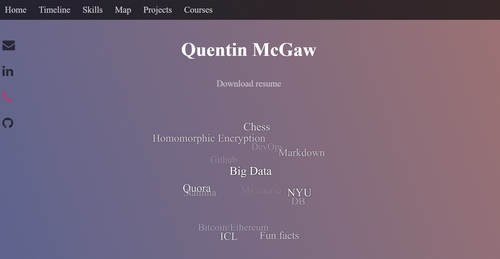
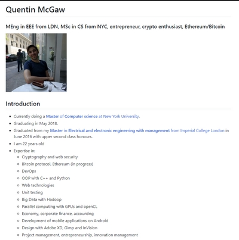

# PersonalWebsite

## HTML Webpage
My HTML-based main personal website is accessible at [https://qdm12.github.io/PersonalWebsite](https://qdm12.github.io/PersonalWebsite)

It uses:
- [Font Awesome](http://fontawesome.io/examples/) for icons such as the ones on the static left toolbar
- The [Three.js](https://threejs.org/) 3D library for the fog background
- The [Particles.js](https://github.com/VincentGarreau/particles.js/) library to create the interconnecting particles background
- The [3D tag cloud](http://www.jqueryscript.net/text/3D-Interactive-SVG-Tag-Cloud-Plugin-With-jQuery-SVG-3D-Tag-Cloud.html)
- The [StoryMap](https://storymap.knightlab.com/)
- The [TimeLine](https://timeline.knightlab.com/)
- The rest is coded from scratch

What has to be done:
- Make it compatible will IExplorer and Safari (untested)
- Do better mobile version
- Replace tag cloud with [http://blog.niklasknaack.de/2017/09/svg-3d-tag-cloud-jquery-plugin-v2.html](http://blog.niklasknaack.de/2017/09/svg-3d-tag-cloud-jquery-plugin-v2.html)
- Finish up the projects section
- Put it on duckdns.org and maybe setup a p2p backup
- Add an iframe of Quora or a sort of live feed (**IMPOSSIBLE**)
- Add more of those fancy backgrounds for the desktop version, with [http://particle-love.com/](http://particle-love.com/)
- Check these links:
   - http://blog.niklasknaack.de
   - http://www.jqueryscript.net/tags.php?/Back%20to%20top/
   - http://www.jqueryscript.net/tags.php?/Bootstrap/
   - http://www.jqueryscript.net/tags.php?/carousel
   - http://www.jqueryscript.net/tags.php?/countdown
   - http://www.jqueryscript.net/tags.php?/Drop%20Down%20Menu
   - http://codepen.io
   - http://threejs.org
   - http://www.jqueryscript.net/tags.php?/form%20validation
   - http://jscompress.com
   - https://tinypng.com,
   - http://caniuse.com
   - http://www.jqueryscript.net/tags.php?/grid%20layout
   - https://twitter.com/niklaswebdev
   - http://nkunited.deviantart.com
   - http://gulpjs.com
   - https://www.browsersync.io
   - https://www.shadertoy.com
   - http://www.jqueryscript.net/tags.php?/tree%20view
   - http://jsperf.com
   - http://foundation.zurb.com
   - http://createjs.com
   - http://julian.com/research/velocity
   - https://greensock.com/docs/#/HTML5/GSAP/TweenLite
   - https://jquery.com
   - http://www.jqueryscript.net/tags.php?/Notification
   - http://www.jqueryscript.net/tags.php?/parallax/

## Markdown webpage
My Markdown-based personal website is accessible at [https://github.com/qdm12/PersonalWebsite/blob/master/markdown/readme.md](https://github.com/qdm12/PersonalWebsite/blob/master/markdown/readme.md)

- This is a simpler yet more complete presentation of myself
- It contains low resolution pictures and all the links you would need to see what I've done so far
- It is more often updated than my website as it is easier to maintain
- It also works very well on mobile devices