# Quentin McGaw

## Introduction
- Doing a [**Master's** of **Computer science** at New York University](https://cs.nyu.edu/home/master/prospective_mscs.html).
- Graduating in May 2018.
- Graduated from my [**Master's** in **Electrical and electronic engineering with 
  management** from Imperial College London](https://www.imperial.ac.uk/study/ug/courses/electrical-engineering-department/electrical-and-electronic-engineering-management/) 
  in June 2016.
- Expertise in:
	- Cryptography and web security :closed_lock_with_key:
	- Bitcoin protocol
    - DevOps :arrows_counterclockwise:
	- OOP with Python and C++ :snake:
	- Web technologies :globe_with_meridians:
	- Parallel computing with GPUs and openCL :hourglass_flowing_sand:
	- Economy, corporate finance, accounting :pound:
	- Development of mobile applications :iphone:
	- Project management, entrepreneurship, innovation management
- Other knowledge in:
	- FPGAs design
	- Artificial intelligence
	- Machine learning
	- Digital Signal processing
	- Mathematics, Control engineering
- French and Mauritian, and lived:
	- 11 years in Luxembourg City :cloud:
	- 1 year in Switzerland, Villars-sur-Ollons :snowflake:
	- 7 years in Nice, France :fr:
	- 4 years in London, UK :guardsman:
    - 5 months in New York City, US :statue_of_liberty: :us:
- Fluent in English :gb:, français :fr: y un poco de español :es:
- I like [Quora](https://www.quora.com/profile/Quentin-McGaw), 
  trading, my [Raspberry Pi](../images/raspberrypi.jpg),
  [Github](https://www.github.com/qdm12), going to the gym :muscle:,
  skiing :ski:, cycling :bicyclist:, 9gag :blush:,
  [Ebay](http://feedback.ebay.ie/ws/eBayISAPI.dll?ViewFeedback2&userid=dowi9876&ftab=FeedbackAsSeller&searchInterval=30) :dollar:,
  Reddit, and [assembling desktops](https://drive.google.com/drive/folders/0B5UPjZHikV5gQ3pyTVR2M3RMaUk?usp=sharing) :floppy_disk: from time to time.

  
  
***

## Work experience :office:

### Industrial placement at Coinplus, 2015

- Six months in a Bitcoin startup in Luxembourg.
	- Regulated and secured storage of bitcoins
	- Regulated transactions of bitcoins
- My role as a software engineer was to develop a security solution for the storage of Bitcoin private keys
    - Cryptography (secret sharing especially)
    - Understanding of the Bitcoin protocol
    - Python programming
    - Networking, rabbitMQ
- The final outcome was the patenting of my solution under the company's name.

### Summer internship at STMicroelectronics, 2014

- Three months at STMicroelectronics in South of France.
	- In the NFC mobile application development team of 15 persons.
	- The company was developing a new NFC chip for Android smartphones.
- My role was to add support for the detection of multiple NFC cards simultaneously by an Android smartphone with their chip
    - Android OS modifications in C, C++ and Java
    - Android app development to showcase the OS modifications made
    - Understanding of the Android OS and of all the NFC technologies to date
    - Use of CyanogenMod on a Nexus devices for testing during development

***

## New York University, September 2016 to May 2018

### Courses
- DevOps
    - Project [**here**](https://qdm12.github.io/Devops_RESTful)
    - Advanced Git, Zenhub :octocat:
    - Vagrant
    - Flask and Python
    - Travis CI, unit testing and behave
    - Docker
    - Redis database
    - IBM Bluemix PaaS
    - Web security
    - Swagger
- Operating System
    - C++ assignments: scheduler, linker, IO, memory management
    - Processes, threads, scheduling, concurrency, memory management, IO, file systems, Networking, cloud and distributed computing
- Mobile online social gaming
    - Chess game project [**here**](https://github.com/qdm12/Chess_2016)
    - Typescript, HTML, CSS
    - Jenkins and code coverage
    - Artificial intelligence
    - PhoneGap and monetizing the app
    - 
- Database Systems
    - Microsoft Visio
- [Programming languages](https://github.com/qdm12/Programming-languages)
    - Scala
- Fundamental algorithms
    - Heap algorithms

### Personal projects
- [Portfolio management](https://github.com/qdm12/Portfolio)
  - Written in Python
  - Web parsing
  - Excel manipulations
  - Use of threads
  - Flask server and Resilio
  - Push notifications to mobile devices  
- [My computing course](https://github.com/qdm12/My-Computing-course)
- [ThumbGifs](https://github.com/qdm12/ThumbGifs) (which is used for this document actually)

***

## Imperial College London, October 2012 to June 2016

### Master's thesis
- [**hbc**](https://qdm12.github.io/hbc/) for Homomorphic binary circuits
- My aim was to develop easy to use digital circuits using fully homomorphic encryption.
    - Understanding of the [HElib library](https://github.com/shaih/HElib)
    - Programming in C++
    - Cryptography and security
- Homomorphic encryption allows to perform analytics on encrypted data, which will be very useful for cloud computing.
- Report available [here](../documents/Homomorphic%20encryption%20Cryptography%20for%20cloud%20computing%20report.pdf)

[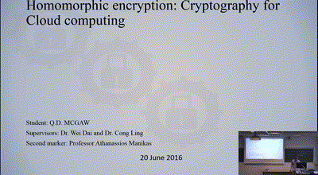](https://youtu.be/n-adgQWZYxI)

### Final year, 2015-2016
#### Courses
- Network and web security
    - Javascript, HTML, SQL
    - Cryptography
- Coding Theory
    - Cryptography
    - Communication theory
	- [30 minutes course I gave to fellow students](../documents/Presentation%20coding%20theory%20Bitcoin.pptx)
- High performance computing for engineers
    - Amazon web services (AWS)
    - C++, OpenCL and TBB (intel)
    - Complex Makefiles
    - Understanding of GPUs architecture
- Mobile healthcare and machine learning
    - [**Android app**](https://github.com/qdm12/Staminapp) development with Android Wear
    - [**Machine learning**](https://github.com/qdm12/Staminaputations) in Python (clustering)
    - NodeJS, SQL database
	- Report available [here](../documents/Stamina%20report.pdf)
	- [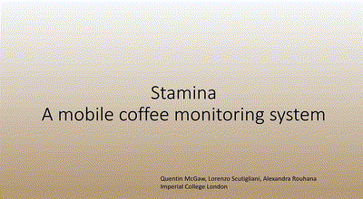](https://drive.google.com/open?id=0B5UPjZHikV5gWVBwUnVpWjZHQVU)
- Managing innovation
- Managerial economics
    - Full syllabus [here](managerial_economics.md)
    - 
- Corporate finance
    - Group [report on the fair valuation of the S&P500](../documents/Fair%20Valuation%20of%20the%20SP500%20index.pdf)
    - Group [presentation on the MSFT Valuation](../documents/Microsoft%20Corp%20(MSFT)%20Valuation.pdf)
    - Full syllabus [here](corporate_finance.md)
    - 

#### Results
I have obtained 67.74% overall

### Third year, 2014-2015
#### Courses
- Digital signal processing
- Advanced signal processing
    - Use of Matlab
	- [Coursework report](../documents/Advanced%20signal%20processing%20report.pdf)
- Artificial intelligence
    - Use of Prologue
- Communication networks
- Real-time digital signal processing
    - Based on C and C++ projects to filter signals
    - [Report on Interrup I/O laboratory](../documents/RTDSP%20report%203.pdf)
    - [Report on Real time implementation of FIR filters laboratory](../documents/RTDSP%20report%204.pdf)
    - [Report on Real time implementation of IIR filters laboratory](../documents/RTDSP%20report%205.pdf)
    - [Report on a speech enhancement project](../documents/RTDSP%20report%20project.pdf)
- Entrepreneurship
    - [Business plan](../documents/Business%20plan%20Sports%20Connect.pdf) about Sports Connect
- Accounting
- Project management
    - Group project on the Boeing 747 project
    
#### Results
I have obtained 54.63% overall
    
### Second year, 2013-2014
#### Courses
- Algorithms and data structures
    - C, C++
    - Binary trees and so on
- Introduction to computer architecture
    - Use of ARM7 assembly language for some assignments
- Semiconductor devices
- Algorithms and complexity
    - *O* notation
    - divide-and-conquer and so on
- Mathematics
- Digital electronics
    - Programming FPGAs using *Verilog* in pairs
    - MPLabs assembler
    - 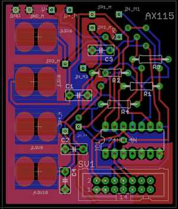
- Analogue electronics
- Power engineering
- Communication systems
- Signal and linear systems
- Control engineering

#### Year group project: *Wasteless*
- Leader of a team of 7 students
- Goal was to develop an ecosystem to reduce the waste of expired food
    - Push notification to the smartphone of the user about food products nearly expired
    - Propose the user to share nearly expired food with neighbours
    - Establish a network of "food friends" with reputation points, messaging and so on
- This involved several technologies and developments
    - At the supermarket level, barcodes were replaced by low-cost RFID chips 
      (contactless) containing the expiry date of the product in addition to 
      the barcode data. This also allowed a faster checkout for the customer.
    - At the customer level, an Android application was developed :iphone:
    - A C++ based server was developed to communicate information on all the goods bought by each user and to handle the food social network.
    - A C++ client program for the cashier at the supermarket was developed.
    - A website was also designed for non-mobile users of Wasteless.
- The final state of the group project was actually promising and we obtained surprisingly high marks :simple_smile:

#### Results
I have obtained 57.43% overall

### First year, 2012-2013
#### Courses
- Software engineering
    - C & C++
- Mathematics
- Professional engineering
    - [Report on Micro NAND flask memory chips](../documents/Profressional%20report%20-%20Micron%2020nm%20MLC%20NAND%20flash%20128Gb%20memory%20chip.pdf)
- Analysis of circuits
    - Use of Cadsoft Eagle and PSPice
- Digital electronics
    - Altera Quartus 12
    - 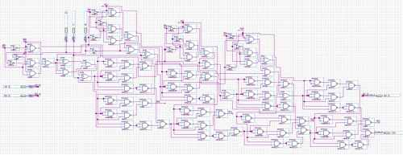
- Semiconductor devices
- Analogue electronics
- Energy conversion
- Signals and communication

#### Year group project: *EEBug*
- Leader of a team of 6 students
- Goal was to build a toy following a black line on the floor for GBP 5.00
- It involved
    - PSPice to design the circuits
    - Project and team management (reports, charts, deadlines...)
    - Hardware testing (opAmps, Resistances etc.)
- 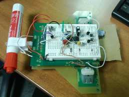
    
#### Results
I have obtained 63.26% overall

### Graduation results
I have obtained my Master's degree with upper second class honours and 61.32% overall
You can check out the certificate [here](../documents/imperial_degree.pdf)

***

## French scientific baccalaureate, 2012
### Courses
- Mathematics with specialty in arithmetics
- Physics and chemistry
- Biology and geology
- History and geography
- Philosophy
- Latin, English, Spanish, French
- Sports

### Articles published in a french Hardware Magazine (2008, 13 years old)
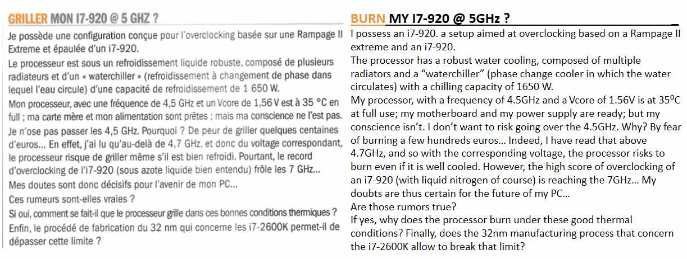

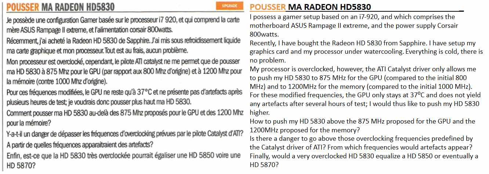

***

## Fun facts :open_mouth:
- I have a UK driving license :red_car:
- I climbed the [Kilimanjaro](https://goo.gl/maps/Pur81wuxvzs) mountain in Tanzania at the age of 12 :mount_fuji:

[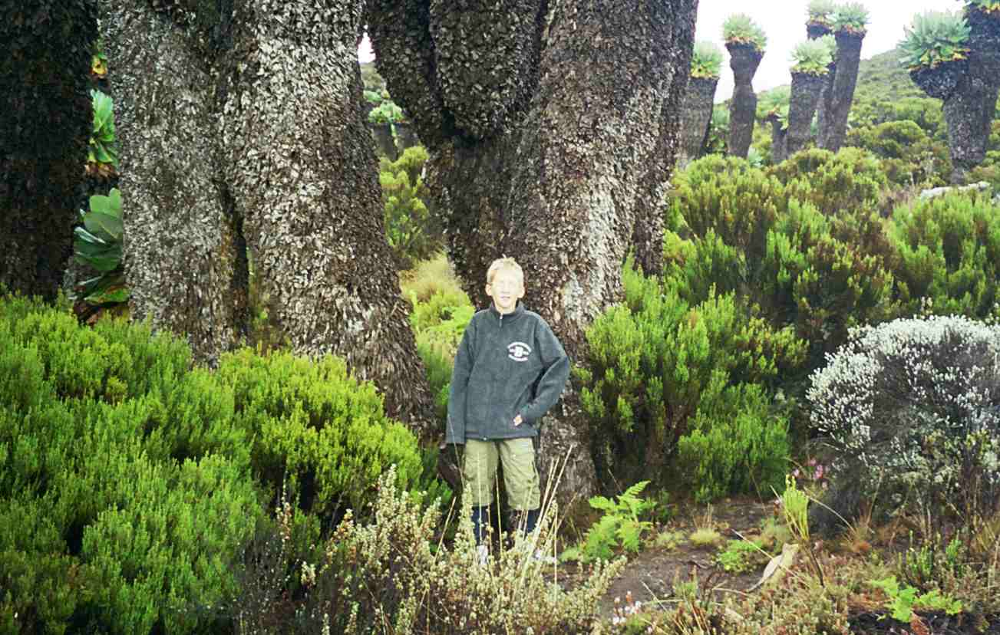](https://goo.gl/maps/Pur81wuxvzs)
[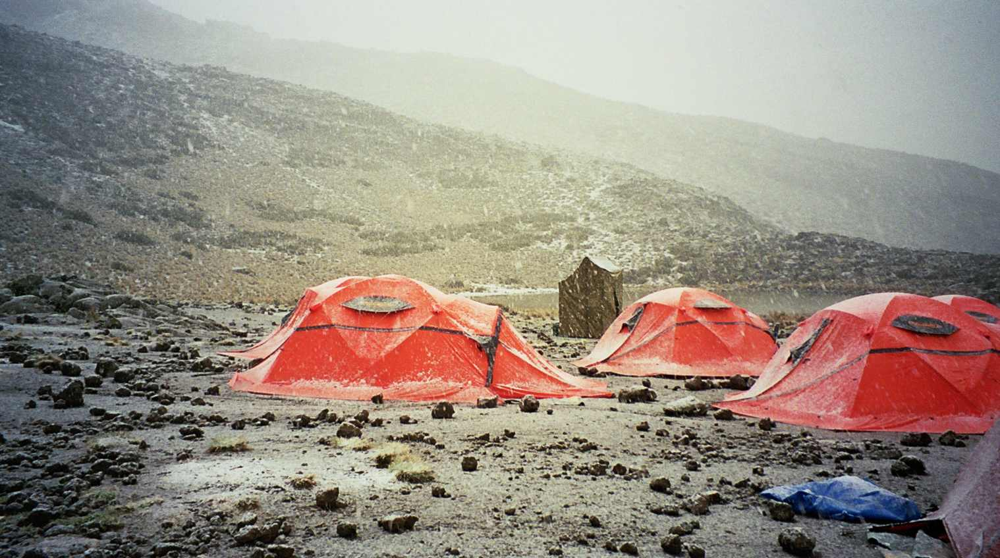](https://goo.gl/maps/Pur81wuxvzs)
- I had a summer job as a waiter and cleaner in the [Castle Venlaw Hotel](https://goo.gl/maps/d6Waq2cGDsp) in Scotland, Peebles :hotel:

[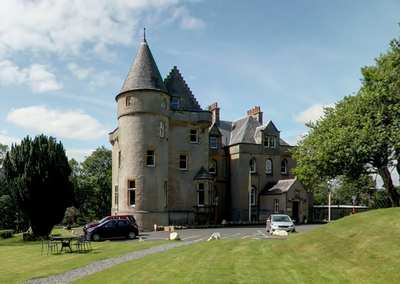](https://goo.gl/maps/d6Waq2cGDsp)
- All my grades are accessible in this [**formatted spreadsheet**](https://docs.google.com/spreadsheets/d/1udRYqsP2acNWp2wQk6SEaNb65T-0Gl_vL5lXWiQSeGQ/edit?usp=sharing)
- I write some funny theories like this [**one**](../documents/fun%20theory.md)
- My Raspberry Pi uses openVPN and another Ethernet connection for SSH access :trollface:

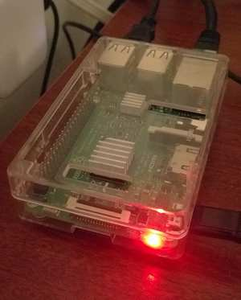

- Some desktop computers I assembled :computer:

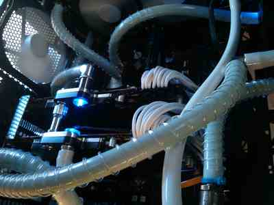
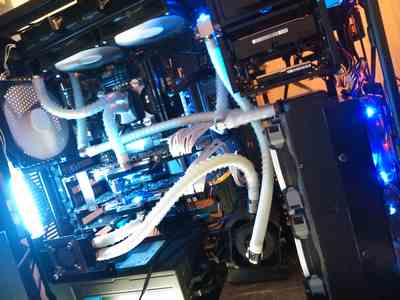
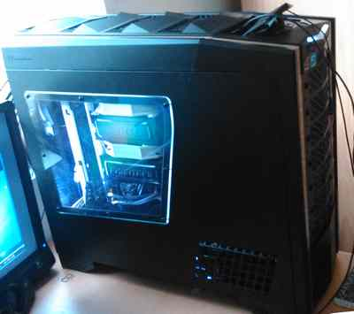
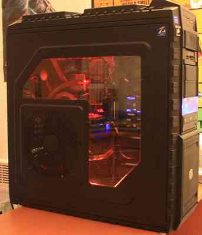
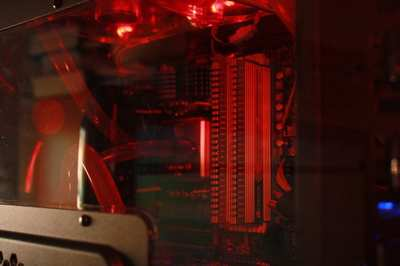
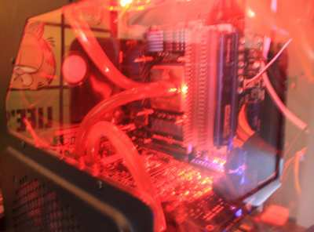
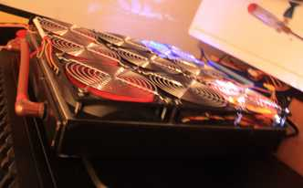
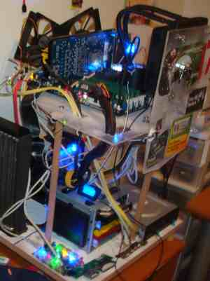
